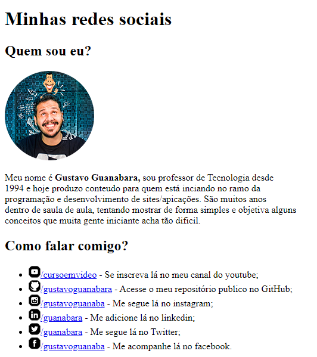

# REDES SOCIAIS VOLUME 1
👨‍🏫PROJETO FEITO PARA O CURSO DE HTML E CSS DO CURSO EM VIDEO.

  

## DESCRIÇÃO:
A página "Redes Sociais" apresenta informações sobre Gustavo Guanabara, um professor de tecnologia que produz conteúdo educacional sobre programação e desenvolvimento de sites e aplicações. Aqui estão os principais elementos da página:

- **Identidade do Autor:**
  - Uma breve introdução sobre Gustavo Guanabara é fornecida, incluindo seu nome, sua ocupação como professor de tecnologia desde 1994 e seu objetivo de tornar conceitos complexos mais acessíveis para iniciantes.

- **Redes Sociais:**
  - Uma lista de redes sociais onde os usuários podem interagir com Gustavo Guanabara é apresentada.
  - Cada rede social é acompanhada por um ícone correspondente e um link para o perfil de Gustavo Guanabara naquela plataforma.

## EXECUTANDO O PROJETO:
1. Abra o arquivo `CODIGO.html` em um navegador da web.
2. Navegue pela página para ler as informações sobre Gustavo Guanabara.
3. Clique nos links das redes sociais para visitar os perfis de Gustavo Guanabara em cada plataforma.
4. Explore as diferentes formas de se conectar e interagir com Gustavo Guanabara através das redes sociais fornecidas.

## NÃO SABE?
- Entendemos que para manipular arquivos em `HTML`, `CSS` e outras linguagens relacionadas, é necessário possuir conhecimento nessas áreas. Para auxiliar nesse aprendizado, oferecemos cursos gratuitos disponíveis:
* [CURSO DE HTML E CSS](https://github.com/VILHALVA/CURSO-DE-HTML-E-CSS)
* [CURSO DE JAVASCRIPT](https://github.com/VILHALVA/CURSO-DE-JAVASCRIPT)
* [CONFIRA MAIS CURSOS](https://github.com/VILHALVA?tab=repositories&q=+topic:CURSO)

## CREDITOS:
- [PROJETO FEITO PELO VILHALVA](https://github.com/VILHALVA)
- [PROJETO FEITO PARA O CURSO DE HTML E CSS](https://github.com/VILHALVA/CURSO-DE-HTML-E-CSS)
- [ESTÁ DISPONIVEL NO SITE](https://vilhalva.github.io/STYLER/STYLER.html)
